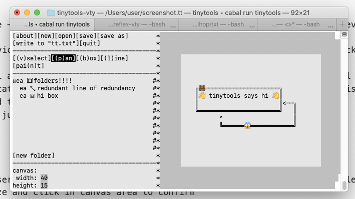

# tinytools-vty

`tinytools` is a mono-space unicode diagram editor written in Haskell and `tinytools-vty` is the [reflex-vty](https://hackage.haskell.org/package/reflex-vty) based view/controller built over the core [tinytools](https://github.com/minimapletinytools/tinytools) model library.



tinytools is still in BETA and may be unstable. Save often!!!

# installation 

## pre-requisites

## from binaries

Binaries are available for x86-64 OSX and Linux:

```
curl -sSL https://raw.githubusercontent.com/minimapletinytools/tinytools-vty/potato/install_tinytools.sh | bash
```

Or see [https://github.com/minimapletinytools/tinytools-vty/releases](releases)

## from source

If you wish to compile from source, you will also need the haskell build tool cabal. The best way to do this is using [ghcup](https://www.haskell.org/ghcup/)

To install tiny tools run `cabal install tinytools-vty` and then you can run `tinytools` 
Or if you are building locally then `cabal run tinytools`

NOTE that `tinytools` is also the name of the base model library for `tinytools-vty`. If you just `cabal install tinytools` you will install the library and not the exe!!!

# usage

When you first run `tinytools` a tutorial file will open which contains information on how to use `tinytools-vty`. 
- To open an empty document do `tinytools --empty` (or `cabal run tinytools -- --empty`) 
- In order to support unicode wide chars (optional), you must first generate the term width file for your terminal `tinytools --widthtable`

`tinytools-vty` has a very intuitive interface and most operations should be clear.

## tools
```
[(v)select][(p)an][(b)ox]      
[(l)ine][pai(n)t]   
```

### the [(v)select] tool

The select tool is your do all tool for interacting with existing elements in your document. Click on individual elements to select or modify it. Click and drag to select multiple elements.

### the [(p)an] tool

click + drag in the canvas area with the pan tool to pan the canvas.

### the [(b)ox] tool

Use the box tool to create boxes. After creating or selecting a box, click on the top border to add or modify a label. Click inside the box to add or modify text. You can change the styling of your lines in the left menu.

```
                                                                                               
         ╔this is a box label══════╗                                                           
         ║                         ║                                                           
         ║this is a box ╔══════════════════════╗                                               
         ║              ║you can align the text║                                               
         ║              ║     in different ways║                                               
         ╚══════════════║                      ║                                               
                        ║                      ║                                               
           ███████████████████═════════════════╝                                               
           █and change the@@@█                                                                 
           █style of the box@█                                                                 
           █@@@@@@@@@@@@@@@@@█                                                                 
           █@@@@@@@@@@@@@@@@@█                                                                 
           █@@@@@@@@@@@@@@@@@█                                                                 
           ███████████████████                                                                 
                                                  
```

### the [(l)ine] tool

Use the line tool to create lines. Lines can attach to existing boxes on either end. After selecting a line, you can move either end point of line or change their attachment. You click and drag in the middle of a line to add midpoints to your line. You can double click on a line to add a line label. Line labels can be moved by clicking and dragging on highlighted handle in the middle. You can change the styling of your lines in the left menu.

```
                                                                                               
    O────different endpoints────────────┐                                                      
                                        O                                                      
                              ╔══════════════════╗                                             
                              ║lines can be      ║                                             
    <═══line label═══════════>║attached to boxes ║                                             
                              ║                  ║<╗                                           
   ^     ╔══════╗             ║                  ║ ║                                           
   ║     ║      ║             ╚══════════════════╝ ║                                           
   ║     ║      ║     |                ^           ║                                           
   ║     ║      ║     |                ╚═══════════╝                                           
   ║     ║      ║     |                                                                        
   ║     ║      ║     |                                                                        
   ║     ║      ║     |                                                                        
   ║     ║      ║     *------different styles------>                                           
   ║     ║      ║                                                                              
   ║     ║      ║                                                                              
   ╚═════╝      ╚═══multi-point line═══>                                                       
                                                                                               
```

### the [(t)ext] tool

Same as the box tool except you can immediately add text to the box without additional clicking!

### the [pai(n)t] tool

The paint tool lets you create areas that take free form text. After selecting a paint area, you can move the cursor anywhere inside and add text.

```
       ╱|、
     (˚ˎ 。7  
      |、˜〵          
     じしˍ,)ノ
```

## layers

On the left hand side is a very sophisticated layering system. All elements will show up in the layer system. You can drag elements around to reorder them. You can add folders to create a hierarchical layer system. You can hide or lock elements in the layers menu. You can select elements in the layers menu to modify.

- to expand/contract a folder, click the `»`/`⇊` 
- to hide/unhide an element and its children, click the `e`/`-` 
- to lock/unlock an element and its children, click thet `a`/`@`
- to create a new folder, click the `[new folder]` button at the bottom
- hold shift to select multiple elements
- selecting a folder impliicitly selects all of its children recursively

## the styling menu

In the bottom left corner, there is a selection-sensitive menu for modifying box line and text styles and setting the canvas size.
Setting the style while elements are selected will modify the style for those elements.
Setting the style while an element creation tool is active will set the default style for all elements to be created.

## shortucts

- (ctrl-s) save
- (ctrl-p) print
- (ctrl-q) quit
- (ctrl-c) copy
- (ctrl-v) paste
- (ctrl-z) undo
- (ctrl-y) redo
- (ctrl-o) open
- (ctrl-n) new


## menu
```
[new][open][save][save as]     
[write to "tt.txt"][quit] 
```

- [new]: creates a new empty doc, prompts to save if there are unsaved changes
- [open]: open a doc from disk, all docs must end .potato extension
- [save]: save the doc to the existing file context, same as save as if no file context
- [save as]: save the doc to a new file context
- [write to "tt.txt"]: writes the doc to "tt.txt"
- [quit]: quit the app, prompts to save if there are unsaved changes


# unicode widechar and grapheme cluster support

Unicode character display width seems to vary by terminal. `tinytools-vty` uses the xterm-256 (mac default terminal) terminal width mappings by default. You can run `tinytools-vty` with the `--widthtable` arg to generate the table to your local config directory for the current terminal. Generating the table samples each unicode character inside the terminal and takes a few seconds to run. Please see the `Graphics.Vty.UnicodeWidthTable` module of the [vty](https://hackage.haskell.org/package/vty) for more info. Grapheme clusters are not really supported by terminals so they are currently disabled 😭.

Also note that many mono-space text displays do not display unicode widechars at a width consistent with its mono-spacing 😕. 


# development

`tinytools`` is still actively being worked on. Here are some things to look out for in the future:

- more native shapes and custom shape support
- glyph widget for easy emoji or ASCII art insertion
- multi-character ASCII font support 
- multi-document support
- multi-user support
- web based frontend